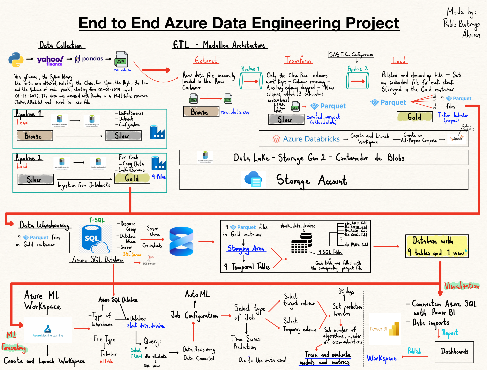

# End to End Azure Data Engineering

This project consist in the implementation of a full data flow (end to end) in the Microsoft Azure´s Cloud. The goal is to ingest historical data from 9 tech stocks, clean it, process to calculate from it technical indicators, then storage them in a Data Warehouse and finally visualized the data in interactive dashboards but also use automated Machine Learning to predict future prices 30 days in advance.

- List of Stock: **AMD**, **AMZN**, **AVGO**, **GOOG**, **META**, **MSFT**, **NVDA**, **ORCL**, **PANW** 

Here is a summary hand-writed by me for better understanding:

# **Project Milestones**

The ETL part follows a kind of Medallion Architecture. But the whole project:

1. Obtaining raw data using Pandas the data was extracted via Yahoo Finance

2. Saving the data in a Data Lake with 3 zones o data process: Bronze → Silver → Gold, in this case the containers are Raw → Curated → Gold  (with Azure Data Factory)

3. Processing y transforming in Databricks (ETL)

4. Consolidating the Gold or final data in a Data Warehouse with Azure SQL Database

5. Visualizing the results in Power BI through dashboards

6. Using Azure AutoML to train, evaluate and predict the following 30 days with multiple models

7. Constantly document and version the whole project in GitHub

# **Stack and Services Used**

| Area             | Service / Tool                         | Main Use                                             |
|------------------|----------------------------------------|------------------------------------------------------|
| Orchestration    | Azure Data Factory (ADF)               | Data movement pipelines (Copy Data and ForEach)      |
| Storage          | Azure Storage Account                  | General-purpose object and file storage.             |
| Storage          | Azure Data Lake Gen2 (ADLS)            | Hierarchical storage (Bronze/Silver/Gold layers)     |
| Processing       | Azure Databricks                       | Spark clusters for transformation with PySpark       |
| Data Warehouse   | Azure SQL Database                     | Structured storage for serving and ML                |
| Data Management  | SQL Server Management Studio (SSMS)    | Database management, querying, and monitoring.       |
| Visualization    | Power BI                               | Interactive dashboards and semantic modeling         |
| Machine Learning | Azure Automated ML                     | Training of time series models                       |
| Languages        | Python (PySpark), SQL                  | Transformation, queries, and measures                |

# **Workflow**

## **1. Data Collection:**
    - Data obtained with yfinance library and processed with pandas.
    - Since 01/01/2014 until 01/11/2025 of 9 stocks.
    - For more information visit `get_raw_data.py`
    - A .csv file was generated `raw_data_ohlcv.csv`

## **2. ETL and Data Manipulation:**
    - The file was uploaded in the `raw` container in the Storage Account.
    - The workspace was created with Azure Databricks connected through SAS Token ensuring the secure link to the Data Lake (ADLS Gen 2), the compute was configured (Single Node → Standard_DS3_v2).
    - In Azure Databricks Workspace with PySpark:
        * The `transform_ingest_curated.py` script inside `Databricks/Notebooks` shows how the raw data was cleaned, the columns that were not the Close price were removed and finally some features changed, 
        * The curated data was saved in a parquet file into `curated` container named 'ohlcv.parquet' (Mea culpa it´s a wrong name that does not match the script intention).
        * The `transform_ingest_gold.py`is in charge of clean again the data, rename columns, divide the 9 files (one for each stock) into parquet files and send them to `gold` container  and also the addition of 3 technical indicators (volatility and trend):
                - SMA 20, SMA 50 and SMA100 to identify the short-term and long-term trend.
                - Daily Return (ROC) to see the percentage change per day with the Close price.
                - Z-Score (20 days) is an statistical measure to keep an eye on volatility and changes respect the short-term SMA20.
    - In this chapter a very simple pipeline was built in Azure Data Factory named and detailed in `ingest_bronze_in_silver_pl.json` and the correspondong Linked Service eas created `stock_datalake_ls.json` to connect the services. The purpose of the pipeline was **Copy** the bronze into silver for get transform later.

## **3. Data Warehousing with Azure SQL Database:**
## **4. Data Collection:**
## **5. Data Collection:**
## **6. Data Collection:**